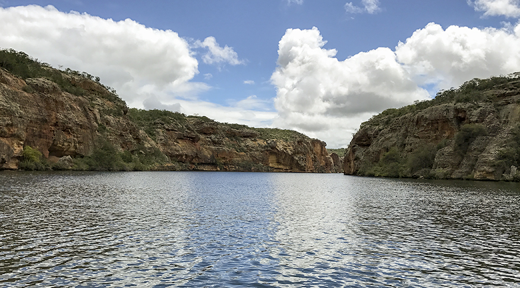

<!--StartFragment-->

                As bases de dados contêm recortes hidrográficos do Brasil compatíveis com a escala 1:250.000, que é mais precisa que as escalas utilizadas até então para a divisão de bacias e mais detalhada que a Divisão Hidrográfica Nacional. [Acesse aqui ambas as bases](https://www.ibge.gov.br/geociencias/informacoes-ambientais/estudos-ambientais/31653-bacias-e-divisoes-hidrograficas-do-brasil.html?=&t=acesso-ao-produto).

                Com a BHB250 e a DHN250, a ANA e o IBGE passam a ter uma base comum de recortes hidrográficos que vai integrar o Quadro Geográfico de Referência para Produção, Análise e Disseminação de Estatísticas do IBGE, além de facilitar o intercâmbio de dados e informações sobre recursos hídricos e outros temas ambientais e socioeconômicos. 

                Com as duas novas bases de dados, pesquisadores, estudantes e interessados no tema terão à disposição uma referência sobre delimitação de bacias hidrográficas e sobre a Divisão Hidrográfica Nacional para fins estatísticos e geográficos, podendo manipular os dados em sistemas de informações. Os produtos das bases de dados divulgadas abrangem dados geográficos em formato vetorial, mapas e relatórios metodológicos.

                Entre as principais informações disponibilizadas por bacia da BHB250, está a estimativa da população residente nas bacias, a disponibilidade de água nelas existente e as estimativas de uso dos recursos hídricos para diferentes setores econômicos. Com isso, será possível considerar os dados para o aperfeiçoamento da gestão e do planejamento de recursos hídricos do País, assim como para a sistematização de estatísticas e indicadores com foco nas bacias.

                A base de detalhamento da DHN250 abrange as 12 regiões hidrográficas (ou macrorregiões) que compõem a Divisão Hidrográfica Nacional determinada pelo CNRH para orientar o planejamento e gerenciamento das águas do Brasil. Também inclui as 54 mesorregiões e 302 microrregiões hidrográficas.  [Relatório Metodológico nº 48](https://biblioteca.ibge.gov.br/visualizacao/livros/liv101854.pdf), divulgado pelo IBGE, detalha as bases de dados e os métodos empregados para sua elaboração.

Acesse a notícia na íntegra: <https://www.omniaonline.com.br/ana-e-ibge-lancam-ineditas-bases-de-dados-hidrograficos-do-brasil/>

<!--EndFragment-->