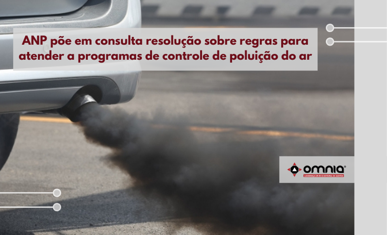

<!--StartFragment-->

A Diretoria da ANP aprovou no dia 23/09, a realização de consulta pública, pelo prazo de 45 dias, seguida de audiência pública, sobre proposta de resolução relativa às especificações dos combustíveis de referência para a homologação de veículos automotores novos em cumprimento às Fases P-8 (veículos pesados), L-7 (veículos leves) e MAR I (máquinas agrícolas e rodoviárias) do Programa de Controle de Emissões Veiculares (Proconve) e M-5 do Programa de Controle da Poluição do Ar por Motociclos, Ciclomotores e Similares (Promot). A nova resolução irá alterar a [Resolução ANP nº 764/2018](https://atosoficiais.com.br/anp/autorizacao-n-764-2018?origin=instituicao).

O Proconve e o Promot, criados pelo Conselho Nacional do Meio Ambiente (Conama), instituem metas progressivas de melhoria da qualidade do ar, negociadas entre órgãos ambientais, produtores de combustíveis e indústria automobilística e de máquinas. Em cada etapa desses programas, são estabelecidos limites máximos de emissões veiculares a serem cumpridos na homologação dos veículos automotores novos.

A proposta de resolução aprovada, prevê alterações de especificações, principalmente, dos limites aplicados aos combustíveis de referência (gasolina E22 e óleo diesel B7), destacando-se a redução do teor de enxofre da gasolina E22 dos atuais 50 mg/kg para 10 mg/kg. As demais alterações não trazem mudanças significativas nas especificações em vigor desses combustíveis. Em sua maioria, referem-se a ampliações em limites de parâmetros, de modo a facilitar o seu atendimento pelos agentes econômicos envolvidos, além de flexibilizar algumas regras vigentes, sem, contudo, comprometer a qualidade dos produtos para a finalidade a que se propõem.  Umas das flexibilizações é possibilidade de utilização do óleo diesel europeu B7 (com teor de 7% de biodiesel) em face da escassez de oferta desse produto no mercado brasileiro. Em relação à fase MAR I, a proposta de resolução adota o óleo diesel B7 de referência já utilizado na fase P8. Essa mudança permitirá o uso do óleo diesel S10 (10 mg de enxofre por kg de *óleo diesel*) que incorpora biodiesel, no teor nele contido, na homologação de máquinas agrícolas e rodoviárias.

Acesse a notícia na íntegra: https://www.omniaonline.com.br/anp-poe-em-consulta-resolucao-sobre-regras-para-atender-a-programas-de-controle-de-poluicao-do-ar/

<!--EndFragment-->