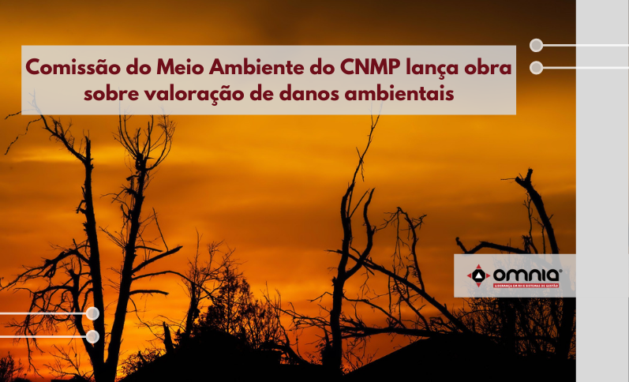

<!--StartFragment-->

A Comissão do Meio Ambiente do Conselho Nacional do Ministério Público (CMA/CNMP) lançou no dia 21/09, a publicação “Diretrizes para valoração de danos ambientais”.

Durante a apresentação, o conselheiro Luciano Nunes afirmou que, no ano de 2020, foi criado, no âmbito da CMA, o Grupo de Estudos sobre a Valoração dos Danos Ambientais, cujo escopo foi o de levantar os métodos de valoração mais utilizados na atuação ministerial, discutir, estudar, pesquisar e compartilhar formas e estratégias de valoração do dano ambiental.

Luciano Nunes destacou que, “com o apoio de todos os Ministérios Públicos brasileiros, de instituições públicas e privadas de grande importância para a preservação do meio ambiente, como o Ibama e universidades, e também de técnicos, pesquisadores e doutrinadores com avançada expertise no assunto, foi possível entregar as diretrizes que ora apresentamos”.   

De acordo com o conselheiro, “o tema da valoração é complexo, mas é também um tema fundamental para garantir a efetividade e a celeridade da atuação finalística do Ministério Público. Foi e é preciso coragem e força de vontade para abordar essa temática delicada e difícil, mas não faltou esse ânimo no trabalho desenvolvido pelo GE da valoração do CNMP”. 

Nesse sentido, o conselheiro Luciano Nunes complementou que “a intenção da publicação é a de facilitar e disponibilizar, com flexibilidade e respeito à independência funcional dos membros do Ministério Público, meios e caminhos viáveis para valorar o dano ambiental. O público-alvo das diretrizes são os membros e os servidores que atuam na linha de frente e lutam diária e arduamente para cumprir a nobre missão do Ministério Público de defender o ambiente”.  

“A obra contém sete capítulos e mais de 500 páginas e será um marco para a atuação ambiental do Ministério Público brasileiro. Servirá, assim, como instrumento para cumprir a honrosa e desafiadora função constitucional de lutar pelo direito essencial ao meio ambiente saudável e equilibrado para o presente e para garantir o futuro sustentável da vida digna no planeta.”, concluiu Luciano Nunes. 

Veja notícia na íntegra pelo link: https://www.omniaonline.com.br/comissao-do-meio-ambiente-do-cnmp-lanca-obra-sobre-valoracao-de-danos-ambientais/

<!--EndFragment-->