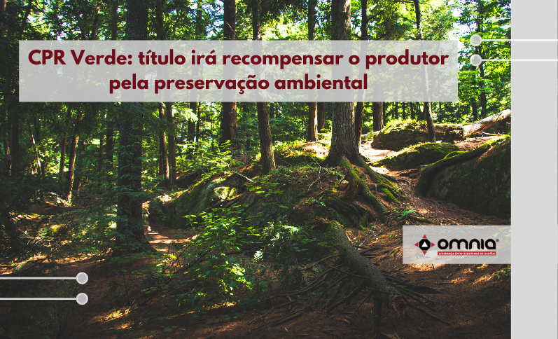

<!--StartFragment-->

A partir de outubro de 2021, o produtor rural brasileiro contará com um novo título para financiar a conservação da parcela de vegetação nativa em sua propriedade. O mercado estimado é de R$ 30 bilhões em quatro anos.

A cédula verde é como um pagamento pelos serviços ambientais prestados pelo produtor, que deixa de abrir novos espaços de vegetação para expandir a sua produção agropecuária.

O Decreto que institui a nova modalidade foi assinado no dia 01/10, pelo presidente Jair Bolsonaro, em cerimônia no Palácio do Planalto. A Cédula de Produto Rural (CPR) Verde poderá ser emitida pelos produtores para atividades de serviços ambientais relacionadas à conservação de florestas e recuperação da vegetação nativa e que resultem, entre outros, em redução de emissões de gases de efeito estufa.

“É um programa extremamente ousado, que veio para fazer justiça ao produtor rural, que é o grande mantenedor do meio ambiente. O que o agro está fazendo, é com responsabilidade, criando esse ambiente sustentável que todos esperam de nós”, destacou o ministro da Agricultura em exercício, Marcos Montes.

O título verde vai funcionar da seguinte forma: ao invés de se comprometer em entregar o resultado da produção agropecuária em pagamento a um recurso financeiro obtido para investimento, o produtor poderá dar como garantia ao dinheiro recebido a manutenção de determinada área florestal em pé.

“Falar de serviços ambientas parece ser muito abstrato e a CPR Verde é um instrumento financeiro que vem para trazer essa concretude. Isso é fundamental para remunerar o produtor nesse desafio de manter essa conservação e isso passa a ter um valor”, explicou o secretário de Política Agrícola do Ministério da Agricultura, Guilherme Bastos.

No Brasil, até então, o produtor que mantivesse a área de floresta preservada, além da parcela obrigatória, não recebia nenhum benefício em troca.

A produção agropecuária de forma sustentável foi defendida pelo ministro da Economia, Paulo Guedes, que reforçou a posição de destaque do Brasil em relação aos demais países por ter também uma matriz energética mais limpa e por ser o celeiro do mundo.

“A cédula verde permite que, a partir do direito de propriedade, se gere riqueza, estimulando a produção. Daqui para frente, o produtor é estimulado nesta transição para a produção verde. Quem tem uma propriedade rural e a preserva ao mesmo tempo em que produz, começa a receber, pela primeira vez, pagamentos por serviços ambientais, o que vai trazer bilhões para a preservação do meio ambiente e das florestas”, frisou Guedes.

A intenção é utilizar a CPR, instrumento já difundido na agropecuária brasileira há mais de 20 anos, para que interessados em fazer compensação de carbono e zerar suas emissões, por exemplo, possam incentivar o setor, gerando uma renda extra para o produtor rural.

“Juntos, conseguimos desenhar uma CPR que vai trazer mais uma possibilidade ao produtor de antecipar recursos de serviços ambientais, lastreados no estoque de carbono da vegetação nativa e na absorção de crédito de carbono na produção agropecuária e em outros benefícios ecossistêmicos”, complementou o ministro do Meio Ambiente, Joaquim Leite.

Leia a notícia na íntegra, e saiba mais sobre esse mercado-> https://www.omniaonline.com.br/cpr-verde-titulo-ira-recompensar-o-produtor-pela-preservacao-ambiental/

<!--EndFragment-->