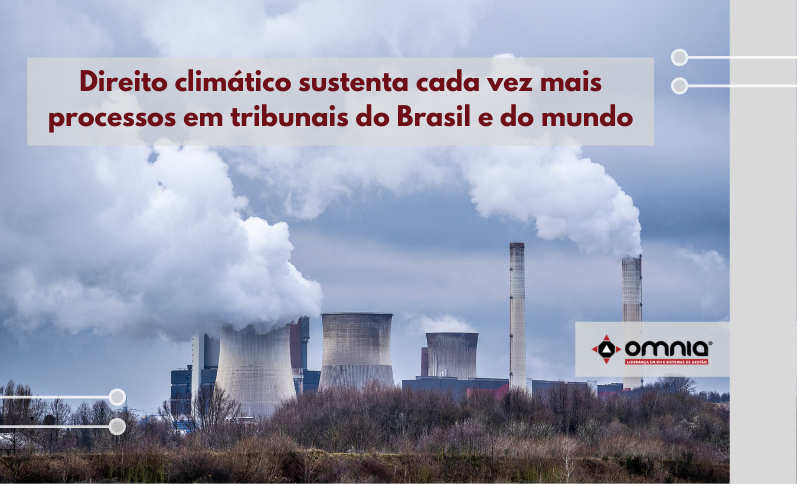

<!--StartFragment-->

Com o aquecimento global se acentuando, o número de ações baseadas no chamado direito climático registradas em tribunais do Brasil e do mundo quase dobrou em três anos. Segundo relatório da ONU, os casos de litigância climática chegaram a 1.550 em 38 países em 2020, ante ao menos 884 em 28 nações em 2017. Os tribunais são acionados para julgar de demandas contra o poder público a licenciamentos e processos relacionados a empresas. Além de efeitos como perda de área verde ou qualidade de água, passou-se a incluir na conta o impacto de gases do efeito estufa. Algumas disputas viraram referência, como a de 12 Estados americanos contra a agência de qualidade do ar.

Na Alemanha, em abril, a Suprema Corte Constitucional decide que as medidas do país contra as mudanças climáticas são insuficientes e exige melhorias. No Brasil, uma “pedalada” federal nos limites das emissões leva um grupo de jovens, no mesmo mês, a mover ação civil pública contra os ex-ministros Ricardo Salles (Meio Ambiente) e Ernesto Araújo (Reações Externas). No México, em outubro, um tribunal colegiado suspende as metas de combate ao aquecimento global e determina que a versão de 2015, mais ambiciosa, seja retomada. Aos poucos, a Justiça mundo afora incorpora ações e conceitos do chamado direito climático.

Não são apenas demandas contra o poder público, mas também em licenciamentos e fiscalização de empresas e proprietários rurais. Aos efeitos diretos dessas atividades econômicas, como perda de área verde ou de qualidade de água, inclui-se na conta o impacto da emissão de gases do efeito estufa. Na esteira de um planeta perto do limite para o aquecimento, a resposta também passa pelos tribunais.

Relatório do Programa de Meio Ambiente da ONU mapeia um rápido crescimento dos casos de litigância climática no mundo. Em 2017, eram ao menos 884, em 28 países; no ano passado, 1.550 em 38 nações. Algumas das disputas já encerradas se tornaram referência, como o caso Massachusetts versus EPA (em que 12 Estados acionaram a agência responsável pela regulação da qualidade do ar nos EUA) e os casos Urgenda, na Holanda, e Leghari, no Paquistão, que reclamavam melhores padrões de controle da poluição.

Leia a notícia na íntegra -> https://www.omniaonline.com.br/direito-climatico-sustenta-cada-vez-mais-processos-em-tribunais-do-brasil-e-do-mundo/

<!--EndFragment-->