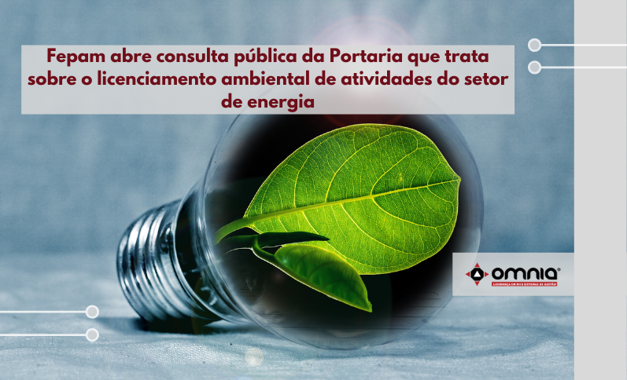

<!--StartFragment-->

A Fundação Estadual de Proteção Ambiental (Fepam) abriu, no dia 14/09, consulta pública da Portaria que dispõe sobre o licenciamento ambiental das atividades de Sistemas de Transmissão, Linhas de Transmissão com tensão igual ou superior a 38kv e Subestações de Energia.  A minuta estabelece diretrizes, definições, critérios e procedimentos.

As considerações recebidas serão analisadas por técnicos da Fundação e poderão ser incorporadas ao documento final.

Veja a noticia na integra através do link: https://www.omniaonline.com.br/fepam-abre-consulta-publica-da-portaria-que-trata-sobre-o-licenciamento-ambiental-de-atividades-do-setor-de-energia/

<!--EndFragment-->