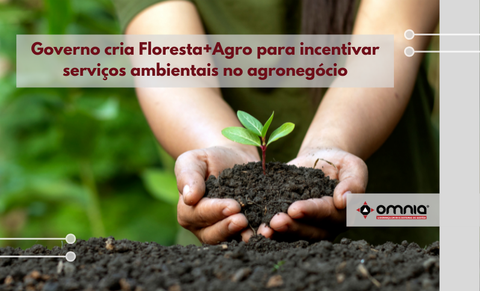

<!--StartFragment-->

O Ministério do Meio Ambiente publicou no dia 27/10 no Diário Oficial da União a portaria 487, que institui a modalidade Floresta+Agro, cuja proposta é o reconhecimento dos serviços ambientais realizados pelos produtores rurais, exclusivamente nas áreas de Reserva Legal e Áreas de Preservação Permanente e que resultem na conservação da vegetação nativa, aumento e manutenção dos estoques de carbono, conservação da biodiversidade, polinização, regulação do clima, disponibilidade hídrica, proteção e fertilidade do solo, ciclagem de nutrientes, entre outros benefícios ecossistêmicos.

Além disso, deverá promover também incentivo ao pagamento por serviços ambientais das atividades de monitoramento, conservação e recuperação de vegetação nativa, realizados pela cadeia produtiva da agropecuária, resultando na manutenção das áreas de floresta.

Prevê ainda o reconhecimento das ações empreendedoras que tenham potencial de implementar arranjos de pagamentos por serviços ambientais nas cadeias produtivas da agropecuária.

“A modalidade do Floresta+ Agro possui como diretriz incentivar as atividades e partes interessadas das cadeias produtivas da agropecuária na realização do pagamento por Serviços Ambientais, compreendidos como o conjunto de atividades de melhoria, recuperação, monitoramento e conservação da vegetação nativa em todos os bioma”, diz a portaria.

Acesse a notícia pelo link-> https://www.omniaonline.com.br/governo-cria-florestaagro-para-incentivar-servicos-ambientais-no-agronegocio/

<!--EndFragment-->