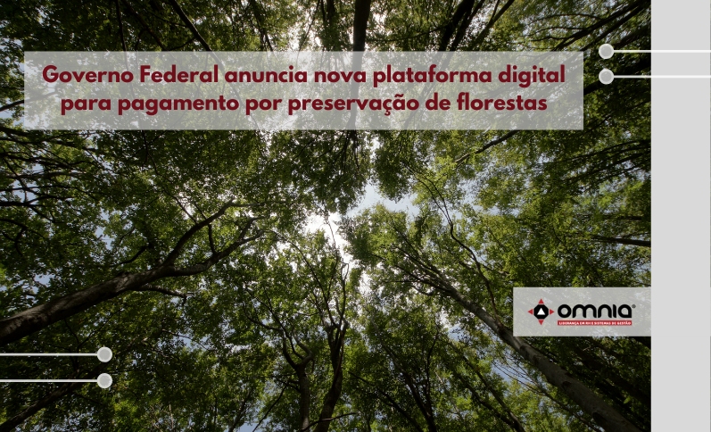

<!--StartFragment-->

Vem novidade por aí. O ministro do Meio Ambiente, Joaquim Leite, anunciou que o governo brasileiro vai apresentar uma nova plataforma digital de gestão para pagamentos de serviços ambientais ainda nesta semana, durante a Cúpula do Clima (COP26), em Glasgow, na Escócia. A iniciativa faz parte do programa Floresta+ e conta com o apoio do Ministério da Economia.

“A plataforma que criamos juntos, de forma integrada, \[irá] levar não só o comando e controle para a área ambiental, \[mas] também \[irá] trazer o incentivo, a remuneração, o reconhecimento de quem faz uma atividade de conservação florestal”, explicou Leite.

A ideia da nova modalidade do Floresta+ é gerenciar, por meio de uma plataforma digital, o pagamento a pessoas físicas e jurídicas que desenvolvem projetos de conservação de áreas de preservação permanente (APPs) e reservas legais. “A proteção da floresta acontece todo dia. Todo dia que ele \[extrativista ou produtor rural] dorme naquele território. Todo dia ele acorda ali e está monitorando aquilo, porque é o ganha pão dele”, disse o ministro.

Leia a notícia na íntegra pelo link: https://www.omniaonline.com.br/governo-federal-anuncia-nova-plataforma-digital-para-pagamento-por-preservacao-de-florestas/

<!--EndFragment-->