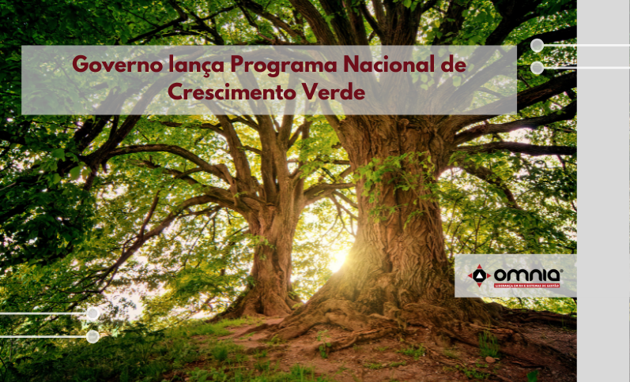

<!--StartFragment-->

O Governo Federal lançou no dia 25/10, em cerimônia no Palácio do Planalto, o Programa Nacional de Crescimento Verde. Coordenado pelos ministérios do Meio Ambiente e da Economia, o programa vai atuar na redução das emissões de carbono, conservação de florestas e uso racional de recursos naturais com geração de emprego verde e crescimento econômico. O anúncio do Programa Nacional de Crescimento Verde contou com a participação do presidente Jair Bolsonaro, dos ministros Tereza Cristina (Agricultura), Paulo Guedes (Economia), Joaquim Leite (Meio Ambiente), entre outras autoridades.

“O Brasil detém a maior biodiversidade do mundo, uma das maiores áreas oceânicas e florestas nativas do planeta, características que se traduzem em vantagens competitivas do país como líder de uma nova agenda verde mundial”, destacou o ministro Joaquim Leite.

Em seu discurso durante o evento, a ministra destacou a criação da Cédula de Produtor Rural Verde, que irá incentivar o produtor rural a produzir preservando e recebendo pagamento por serviços ambientais. “Por meio de iniciativas sustentáveis, o Brasil continuará a fortalecer a agropecuária, um dos setores mais vulneráveis à mudança do clima”, disse Tereza Cristina.

O anúncio ocorre a menos de uma semana do início da 26ª Conferência sobre as Alterações Climáticas (COP26), que será entre os dias 31 de outubro e 12 de novembro, em Glasgow, na Escócia. Trata-se do principal encontro da Organização das Nações Unidas (ONU) sobre clima e meio ambiente, e deve reunir representantes de mais de 190 países. A comitiva brasileira será liderada pelo ministro do meio ambiente.

Atualmente, o governo federal conta com linhas de crédito que, somadas, chegam a R$ 400 bilhões. O Programa será guiado por incentivos econômicos, transformação institucional e critérios de priorização de políticas públicas e projetos e ações do setor privado.

Os incentivos econômicos terão como foco a promoção do desenvolvimento de instrumentos de mercado. No âmbito da transformação institucional, o propósito é fazer com que ações do governo federal potencializem projetos verdes. Já os critérios de priorização visam dar destaque às iniciativas verdes.

As linhas de crédito previstas no programa contemplam projetos verdes em áreas como: conservação e restauração florestal, saneamento, gestão de resíduos, ecoturismo, agricultura de baixa emissão, energia renovável, mobilidade urbana, transporte e logística, tecnologia da informação e comunicação e infraestrutura verde. Esses recursos impulsionarão a economia, gerando empregos e contribuindo para a consolidação do Brasil como a maior economia verde do mundo.

Leia a notícia na íntegra-> https://www.omniaonline.com.br/governo-lanca-programa-nacional-de-crescimento-verde/ 

<!--EndFragment-->