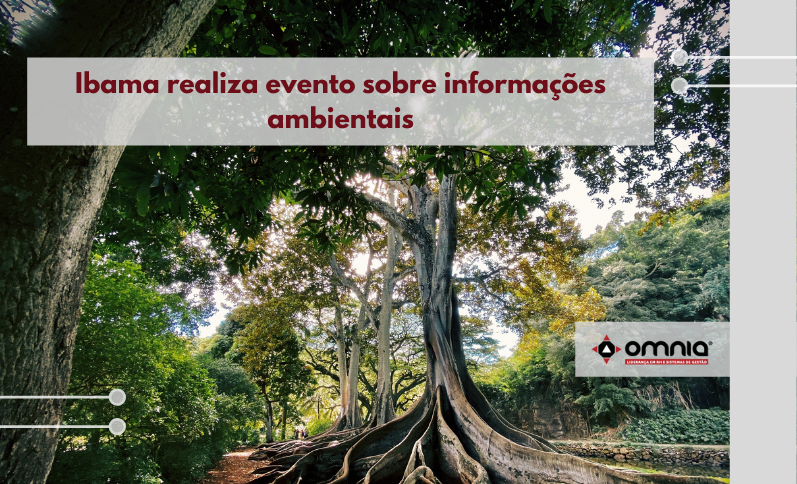

<!--StartFragment-->

Em novembro, o Instituto Brasileiro do Meio Ambiente e dos Recursos Naturais Renováveis (Ibama) irá realizar o Seminário CTF/APP: o Sisnama e o Valor das Informações Ambientais. O evento incluirá mesas-redondas e palestras sobre temas como PIB Verde, Contas Ambientais, Sistema Nacional de Informações Ambientais (Sisnama) e integração de dados, entre outros assuntos. O público-alvo prioritário são os servidores da administração ambiental nas três esferas de governo e também pesquisadores e interessados no tema. As inscrições serão abertas em outubro.

O Ibama tem compromisso com a geração de informações ambientais qualificadas e se posiciona de forma estratégica nesse cenário. O Instituto gerencia um instrumento tipicamente informacional instituído pela Política Nacional de Meio Ambiente: o Cadastro Técnico Federal de Atividades Potencialmente Poluidoras e Utilizadoras de Recursos Ambientais, maior base de dados do Sistema Nacional de Meio Ambiente.

São 420 mil pessoas jurídicas e 1,5 milhão de pessoas físicas inscritas nesse Cadastro. A partir de uma relação de 195 atividades controladas ambientalmente no âmbito federal, é possível identificar quem exerce cada atividade, quando essas atividades foram iniciadas, onde esses empreendimentos estão situados e o porte financeiro de cada um.

A gestão do Cadastro caminha no sentido de integrar dados também dos órgãos estaduais ambientais e de todos os sistemas de controle do Ibama, e de disponibilizar essas informações à sociedade por meio de diversas ferramentas, de modo a subsidiar as políticas públicas e a identificar os agentes que estão em situação de regularidade perante as normas ambientais.

Acesse a noticia completa clicando no link: https://www.omniaonline.com.br/ibama-realiza-evento-sobre-informacoes-ambientais/

<!--EndFragment-->