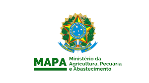

<!--StartFragment-->

Ministério da Agricultura, Pecuária e Abastecimento (Mapa) publicou no dia 27/08, no Diário Oficial da União, a Portaria nº 385 que estabelece os critérios e procedimentos para a realização de tratamentos fitossanitários com fins quarentenários. A medida visa o atendimento de requisitos fitossanitários dos países importadores na certificação fitossanitária internacional, nas operações de exportação ou aplicação de medidas fitossanitárias prescritas pelo Mapa nas operações de importação.

O tratamento fitossanitário quarentenário é uma medida determinada pelo Ministério da Agricultura para prevenir a introdução e disseminação de pragas durante as operações de exportação e importação de vegetais e seus produtos, e outros artigos regulamentados, como embalagens e suportes de madeira, por exemplo.

A Portaria prevê o prazo de 180 dias para as empresas já credenciadas adequarem sua documentação e seus procedimentos, e revoga a Instrução Normativa nº 66/2006.

Acesse a notícia na íntegra em: <https://www.omniaonline.com.br/mapa-regulamenta-tratamentos-fitossanitarios-com-fins-quarentenarios/>

<!--EndFragment-->