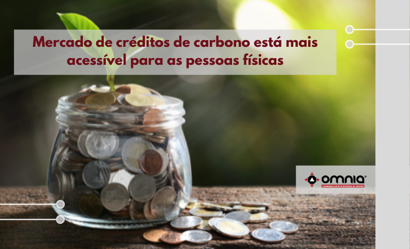

<!--StartFragment-->

Depois de compensar as emissões de gases do efeito estufa da sua vinícola em Bento Gonçalves (RS), o irlandês Gordon Murphy, 31 anos, decidiu que era hora de tornar a coisa mais pessoal e compensar a própria pegada de carbono. Transporte, alimentação, bens consumidos, resíduos – tudo foi devidamente lançado na calculadora de uma plataforma de crédito de carbono. Ele descobriu ser responsável pelo equivalente a 5,7 toneladas de CO2 por ano.

“O maior fator de emissão, no meu caso, foi o transporte aéreo, por causa das viagens de avião para acompanhar a produção no Rio Grande do Sul e para visitar familiares na Irlanda”, explica Murphy, morador de São Paulo, que vai pagar R$ 52 por mês para a compensação total. “Achei bem barato. É o custo de uma assinatura mensal de serviço de streaming. E, com isso, estarei alinhado aos valores do meu próprio negócio.”

Murphy é representante de uma minoria que compensa a própria pegada de carbono. Esse grupo, porém, é crescente. Novas plataformas e ferramentas têm tornado mais simples e rápido para pessoas físicas acessarem o mercado de crédito de carbono, antes restrito a grandes negócios. Carbonext, EcoCart e Moss são algumas das que contribuem para o cálculo das emissões e fazem a ponte com projetos certificados e auditados de reflorestamento e proteção ambiental de florestas.

Leia a notícia na íntegra -> https://www.omniaonline.com.br/mercado-de-creditos-de-carbono-esta-mais-acessivel-para-as-pessoas-fisicas/

<!--EndFragment-->