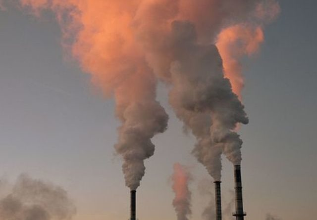

<!--StartFragment-->

Essa plataforma, alimentada automaticamente por dados locais e seguindo padrões internacionais de classificação, vai integrar os dados de todas as estações de monitoramento de qualidade do ar no Brasil; 126 estações já foram integradas. Os cinco estados já integrados (BA, ES, MG, RS e SP) totalizam 45% da população brasileira.

O programa Ar Puro se soma aos programas Lixão Zero, Cidades+Verdes, Combate ao Lixo no Mar e Recuperação de Áreas Contaminadas, lançados nos últimos dois anos. Preparando o terreno para o lançamento do Ar Puro, o MMA já havia feito uma entrega importante na área, com a publicação do [Guia Técnico para o Monitoramento e Avaliação da Qualidade do Ar](https://www.gov.br/mma/pt-br/assuntos/agendaambientalurbana/ar-puro/guia-tecnico-para-qualidade-do-ar).

Leia a notícia na integra através do link: <https://www.omniaonline.com.br/ministerio-do-meio-ambiente-anuncia-programa-ar-puro-para-melhorar-qualidade-do-ar-nas-cidades-do-brasil/>

<!--EndFragment-->