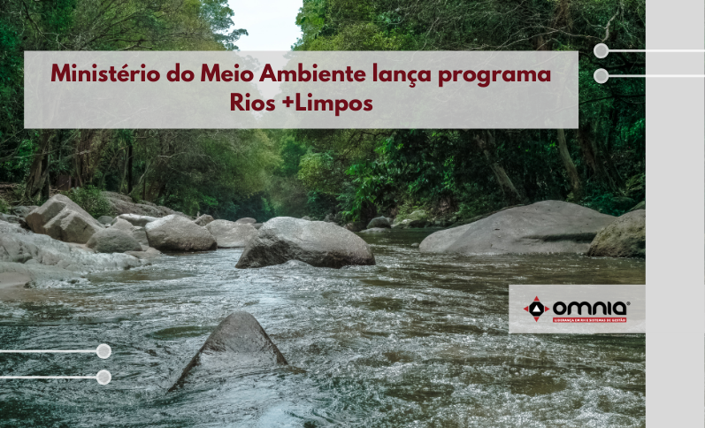

<!--StartFragment-->

O Ministério do Meio Ambiente lançou no dia 16/09, o último eixo da Agenda Ambiental Urbana, o programa Rios +Limpos. Esse sistema vai oferecer mais transparência para os usuários e gerar incentivo a melhorias operacionais, além de aprimorar a orientação de ações de fiscalização pelos órgãos ambientais e agências reguladoras, com instrumentos para verificação das metas de desempenho.

A iniciativa visa ainda fomentar ações de despoluição dos rios, incentivar a limpeza e coleta de lixo em rios, lagos, lagoas e praias fluviais, além da implementação de sistemas de tratamento descentralizado de efluentes em áreas não atendidas pelos sistemas tradicionais, bem como a promoção de projetos que visem o reuso de efluentes no país.

Para acessar a notícia na integra clique no link-> https://www.omniaonline.com.br/ministerio-do-meio-ambiente-lanca-programa-rios-limpos/

<!--EndFragment-->