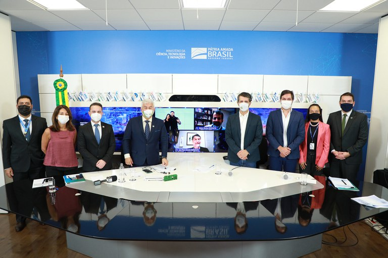

<!--StartFragment-->

A entrega mais importante do MCTI foi o anúncio da ampliação da plataforma AdaptaBrasil MCTI que passará a abranger todos os municípios do país. A AdaptaBrasil foi desenvolvida em parceria com a Rede Nacional de Ensino e Pesquisa (RNP) e o Instituto Nacional de Pesquisas Espaciais (INPE), ambas instituições vinculadas ao ministério.  A plataforma integra informações que permitem avaliar o avanço das análises dos impactos da mudança do clima, observados e projetados no território nacional.

O coordenador-geral de Ciência do Clima e Sustentabilidade (CGCL) da SEPEF do MCTI, Márcio Rojas, explica qual a funcionalidade da plataforma. “Fundamentalmente o AdaptaBrasil serve para tomada de decisão com relação a adaptação climática. A ideia é que nos ofereça uma série de informações com relação aos impactos das mudanças climáticas com base não só em indicadores do momento atual, mas também com base em cenários projetados para o futuro, 2030, 2050 em uma situação de otimismo e em uma situação de pessimismo”. Rojas reforça também para quem a informação da plataforma pode ser útil. “A ideia aqui é oferecer conhecimento para que os mais diversos atores da sociedade, não só gestores subnacionais como governadores ou prefeitos, mas também para a iniciativa privada e pesquisadores”.

Outra entrega importante do MCTI para as questões climáticas foi a do Inventário Nacional de Emissões e Remoções de Gases Efeito Estufa que agora será separado por estados. A elaboração do documento foi coordenada pelo MCTI e o objetivo é compartilhar informações técnico-científicas produzidas no âmbito da Quarta Comunicação Nacional (4CN) do Brasil à Convenção-Quadro das Nações Unidas Sobre Mudança Climática (UNFCCC, sigla em inglês). O envio do documento para a UNFCCC faz parte de um compromisso assumido pelo governo brasileiro ao ratificar a adesão à convenção do clima da ONU em 1994.

**Conheça as ferramentas**:

SINAPSE MCTI: [www.gov.br/mcti/sinapse](http://www.gov.br/mcti/sinapse)\
Adapta Brasil: <https://adaptabrasil.mcti.gov.br/>\
Inventário Nacional:[ https://www.gov.br/mcti/pt-br/acompanhe-o-mcti/sirene/emissoes/emissoes-por-unidade-federativa](https://www.gov.br/mcti/pt-br/acompanhe-o-mcti/sirene/emissoes/emissoes-por-unidade-federativa)

Acesse a notícia na íntegra: <https://www.omniaonline.com.br/ministerio-lanca-ferramentas-para-controle-e-adaptacao-as-mudancas-climaticas/>

<!--EndFragment-->