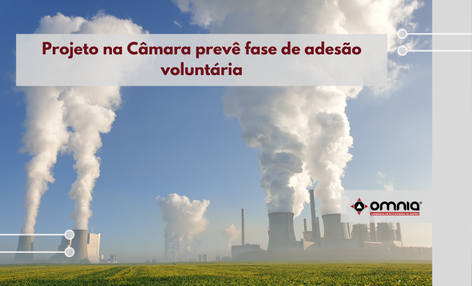

<!--StartFragment-->

O projeto de lei em discussão na Câmara, que cria um mercado regulado de carbono para o Brasil, prevê uma fase de adesão voluntária nos primeiros dois anos de implementação. Depois, haveria uma transição para a entrada obrigatória dos setores que serão afetados. A proposta foi aprovada pela Comissão de Desenvolvimento Econômico, Indústria, Comércio e Serviços (CDEICS) da Casa, e agora aguarda um parecer na Comissão de Meio Ambiente, onde é relatada pela deputada Carla Zambelli (PSL-SP).

No geral, o texto traça diretrizes do chamado Mercado Brasileiro de Redução de Emissões. Um passo essencial para o funcionamento desse mercado é o chamado Sistema Nacional de Registro de Inventário de Emissões de GEE. Será a partir dele que será possível assegurar a credibilidade e segurança das transações com esses ativos, servindo ainda como ferramenta para contabilidade das trocas nacionais e internacionais com créditos de carbono originados no País. O projeto não estabelece previamente qual estrutura governamental será responsável pelo sistema de registro, apenas que ele será administrado por uma instituição existente ou criada pelo Executivo.

“A questão da MRV (medição, relatório e verificação) é central. Toda essa parte de registro de emissões precisa estar muito redonda. Sem essa parte de medição, você não consegue. A parte de auditoria também. Precisa ter um sistema muito robusto”, disse o gerente executivo de Meio Ambiente e Sustentabilidade da Confederação Nacional da Indústria (CNI), Davi Bomtempo.

A implantação do mercado de carbono no Brasil deverá acontecer em fases. Um dos grandes colaboradores do projeto, o Conselho Empresarial Brasileiro para o Desenvolvimento Sustentável (CEBDS) sugere que estejam dentro do instrumento instalações que emitem anualmente acima de 50 mil toneladas de CO2 equivalente (tco2e). Inicialmente, o controle deve afetar setores intensivos em carbono e, com o passar do tempo, seriam incluídos outros gases de efeito estufa e mais setores industriais.

Estar dentro de um mercado regulado de carbono, por sua vez, também tem vantagens competitivas. Além de inserir a empresa num novo modelo de negócios, a preocupação crescente do consumidor em comprar produtos ambientalmente responsáveis torna esse “selo” de economia de baixo carbono ainda mais atrativo. “Consumidor quer saber quanto de carbono você utiliza, como tratou o recurso hídrico, eficiência energética, como fez gestão de seu resíduo. Tudo isso conta nessa agenda e traz necessidade de o empresário fazer essa mudança de mindset para se adequar a essa nova ordem global”, afirmou Bomtempo.

Acesse a notícia na íntegra -> https://www.omniaonline.com.br/projeto-na-camara-preve-fase-de-adesao-voluntaria/

<!--EndFragment-->