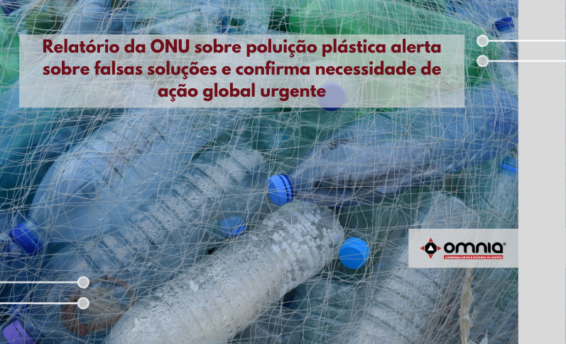

<!--StartFragment-->

Uma redução drástica do plástico desnecessário, evitável e problemático é crucial para enfrentar a crise global de poluição, de acordo com uma análise abrangente divulgada hoje pelo Programa das Nações Unidas para o Meio Ambiente (PNUMA).

Acelerar a transição para energias renováveis, eliminar subsídios e adotar abordagens circulares ajudará a reduzir os resíduos plásticos na escala necessária, de acordo com o relatório Da Poluição à Solução: Uma Análise Global sobre Lixo Marinho e Poluição Plástica (*From Pollution to Solution: A Global Assessment of Marine Litter and Plastic Pollution*).

O relatório mostra que a poluição plástica é uma ameaça crescente em todos os ecossistemas, de onde a poluição se origina até o mar. Mostra também que, embora tenhamos o conhecimento, precisamos da vontade política e da ação urgente dos governos para enfrentar esta crise crescente.

O relatório alimentará as discussões na Assembleia das Nações Unidas para o Meio Ambiente (UNEA 5.2) em março de 2022, quando os países se reunirão para decidir o caminho a seguir para a cooperação global sobre esta questão.

O estudo destaca que a poluição plástica nos ecossistemas aquáticos cresceu consideravelmente nos últimos anos e deve dobrar até 2030, com consequências terríveis para a saúde, a economia, a biodiversidade e o clima.

A análise, divulgada dez dias antes da 26ª Conferência das Partes da Convenção sobre Mudança do Clima (COP26), enfatiza que o plástico também é um problema climático. Usando uma análise de ciclo de vida, estimou-se que em 2015 os plásticos estavam ligados à produção de 1,7 gigatoneladas de CO2 equivalente (GtCO2e), e em 2050 este número deverá aumentar para aproximadamente 6,5 GtCO2e – 15% do orçamento global de carbono.

Os autores rejeitam a possibilidade de reciclagem como uma saída para esta crise e alertam para alternativas nocivas aos produtos de uso único, tais como plásticos de base biológica ou biodegradáveis, que atualmente representam uma ameaça química semelhante aos plásticos convencionais.

O relatório analisa falhas críticas do mercado, tais como preços baixos de matérias-primas fósseis virgens versus materiais reciclados; esforços mal articulados no gerenciamento formal e informal de resíduos plásticos; e a falta de consenso sobre soluções globais.

Acesse a notícia na íntegra -> https://www.omniaonline.com.br/relatorio-da-onu-sobre-poluicao-plastica-alerta-sobre-falsas-solucoes-e-confirma-necessidade-de-acao-global-urgente/

<!--EndFragment-->