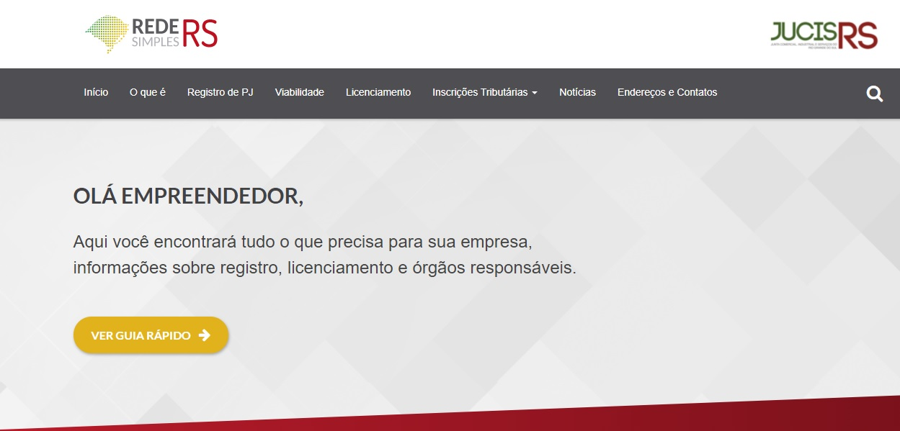

<!--StartFragment-->

A nova Tabela de Classificação de Riscos no Licenciamento Ambiental já está em vigor e “simplifica os passos para o futuro empreendedor na hora de encaminhar a documentação, economizando tempo, evitando gastos desnecessários, e principalmente, gerando segurança jurídica ao cidadão”, afirma Tomás Holmer, coordenador do Descomplica RS, projeto do governo do RS. Com a adequação, o Rio Grande do Sul passará a ser o Estado com o maior número de atividades de baixo risco relacionadas.

                Conforme o chefe da Divisão de Licenciamento da Fepam, Jorge Berwanger, “foi realizada uma análise minuciosa que vai gerar grande ganho para os serviços de baixo risco e também fomentar e induzir à regularidade as demais atividades”. De um total de 972 atividades, 656 podem iniciar a operação sem necessidade de licenciamento ambiental. Outras 316 poderão ser isentas, se o exercício da atividade pretendida não apresentar características como de alto risco.

                A nova tabela fornece informações por meio de passos dentro do portal Redesimples (Rede Nacional para a Simplificação do Registro e Legalização de Empresas e Negócios), no qual o empresário ou futuro empreendedor pode consultar a viabilidade e simular o grau de risco do empreendimento. Para quem precisa de licenciamento, no portal também é possível verificar o andamento dos processos e inserir informações e documentos necessários. É importante ter o cadastro gov.br, o mesmo utilizado para acessar carteira digital de habilitação ou o cartão do SUS.

                Como resultado dessa nova classificação, das 1.332 atividades existentes hoje no Brasil (CNAEs), a Fepam passa a considerar 972 entre baixo risco e baixo risco condicionado (656 de baixo risco e 316 de baixo risco condicionado), 357 de alto risco e três consideradas de não interesse por serem competência federal.

Acesse a notícia na íntegra: <https://www.omniaonline.com.br/rs-processo-de-licenciamento-ambiental-e-adequado-a-lei-da-liberdade-economica-para-acelerar-abertura-de-empresas/>

Acesse a rede simples: <https://redesimples.rs.gov.br/>

<!--EndFragment-->