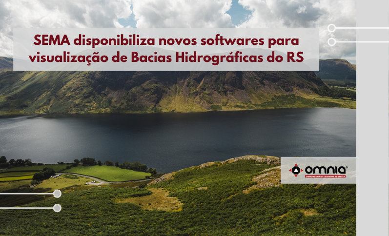

<!--StartFragment-->

O Departamento de Gestão Recursos Hídricos e Saneamento (DRHS) da Secretaria do Meio Ambiente e Infraestrutura (Sema) divulgou uma nota técnica, disponibilizando novos formatos para visualização do enquadramento das Bacias Hidrográficas do Rio Grande do Sul. A partir de agora, é possível verificar as situações atuais e mapas das bacias pelos softwares shapefiles (.shp) e .kmz.

Para acessar o documento, [clique aqui.](mailto:https://www.sema.rs.gov.br/upload/arquivos/202109/15160937-nt-dipla-2021-003-enquadramento.pdf)

A chefe da Divisão de Planejamento e Gestão do DRHS da Sema, Raíza Schuster, conta que o arquivo pode ser acessado de forma prática a partir das novas atualizações. “As informações estavam disponíveis apenas nas resoluções do Conselho Estadual de Recursos Hídricos (CRH). Agora, com os novos formatos .shp e .kmz, é possível acessar por meio de softwares de Sistemas de Informações Geográficas (SIGs), como:  Qgis, ArcGIS e Google Earth”.

O enquadramento das Bacias Hidrográficas visa assegurar às águas, qualidade compatível com os usos mais exigentes a que forem destinadas e diminuir os custos de combate à poluição, mediante ações preventivas permanentes.

Acesse a notícia na íntegra -> https://www.omniaonline.com.br/sema-disponibiliza-novos-softwares-para-visualizacao-de-bacias-hidrograficas-do-rs/

<!--EndFragment-->