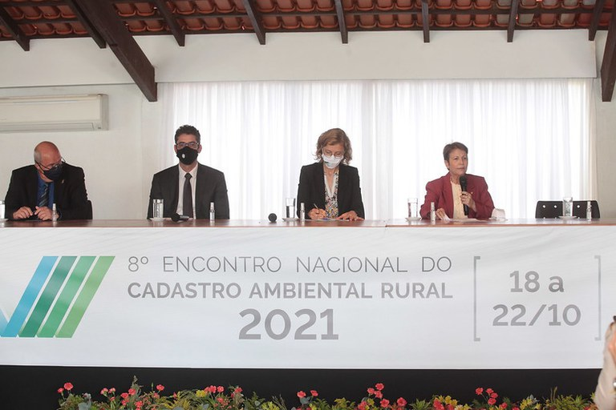

<!--StartFragment-->

A notícia foi dada no dia 18/10, pela ministra da Agricultura, Pecuária e Abastecimento (Mapa), Tereza Cristina, durante o  8º Encontro Nacional do Cadastro Ambiental Rural 2021, que reúne gestores do CAR para discutir os desafios e estratégias para avançar na agenda de regularização ambiental de forma cooperada.

Na abertura do Encontro, a ministra disse que o alinhamento com os estados é fundamental para a efetiva implementação do Código Florestal no Brasil. “Com isso, teremos transparência, regularidade ambiental, bem como garantiremos a produção agropecuária aliada à conservação ambiental, fortalecendo a característica única da agropecuária brasileira de produzir e conservar”.

Ela colocou o Mapa e o Serviço Florestal à disposição dos estados para resolver gargalos e ajudar na implementação do CAR em todo o país. “Nós fazemos só a coordenação, mas vocês fazem a implementação, que é o mais importante. Estamos de portas abertas para ajudar no que for preciso”, disse a ministra ressaltando que essa é uma política prioritária para o Ministério.

O Programa de Regularização Ambiental - PRA compreende um conjunto de ações e iniciativas que devem ser desenvolvidas por proprietários/possuidores de imóveis rurais para a adequação e promoção da regularização ambiental de seus imóveis.

Os proprietários/possuidores que dispuserem de passivo ambiental relativo à supressão irregular de remanescentes da vegetação nativa, que ocorreu até 22 de julho de 2008, em APP, Reserva Legal e de uso restrito, que tiverem inscrição no CAR poderão solicitar adesão ao PRA do estado em que estiver inserido, para que seja continuada a regularização ambiental do seu imóvel. A regularização ambiental se dará então mediante recuperação, recomposição, regeneração ou compensação.

Para que se dê a regularização ambiental, porém, o proprietário/possuidor precisa também aderir e cumprir as obrigações estabelecidas no Termo de Compromisso, que será específico por imóvel. As multas e sanções em decorrência das infrações cometidas poderão ser, então, revertidas em serviços de preservação, melhorias e recuperação da qualidade do meio ambiente, entre outras.

Está precisando regularizar seu imóvel?

Nós da BDS Consultoria Ambiental podemos te ajudar. Solicite seu orçamento.

Acesse a notícia na íntegra: <https://www.omniaonline.com.br/servico-florestal-anuncia-ferramenta-para-adesao-de-produtores-ao-programa-de-regularizacao-ambiental/>

<!--EndFragment-->