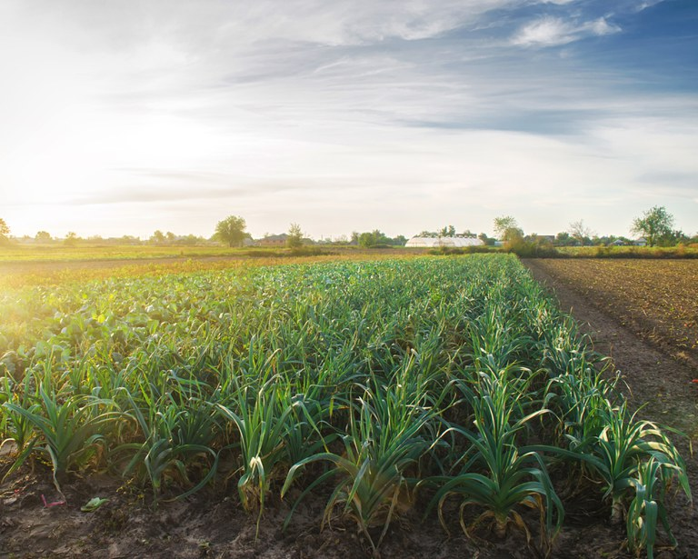

<!--StartFragment-->

Amapá e Paraná são os primeiros estados a aderirem ao novo sistema de análise dinamizada do Cadastro Ambiental Rural (CAR), o AnalisaCAR. O módulo, lançado em maio, permite que a análise dos cadastros seja feita por lotes, o que traz celeridade e eficiência para a tarefa que até então estava sendo realizada de forma manual pelas equipes dos órgãos ambientais estaduais.

A Secretaria de Meio Ambiente do Amapá (Sema/AP) também já começou a usar o módulo e iniciou a análise dos primeiros lotes de cadastros usando a nova tecnologia. O estado foi o primeiro a ter o sistema implantado, por já possuir os mapeamentos necessários e já ter participado de capacitações sobre como operar a ferramenta.

Desenvolvida pelo SFB com apoio tecnológico da Universidade Federal de Lavras (UFLA), o AnalisaCAR possibilita que os cadastros sejam verificados de forma automatizada, por meio de tecnologias de geoprocessamento que comparam os dados declarados com mapas de referência, que funcionam como o gabarito para a checagem das informações. A expectativa do SFB é que até o fim do ano pelo menos dez estados estejam utilizando a ferramenta, que será disponibilizada para todo o país em um prazo de dois anos.

Leia a notícia na integra através do link: <https://www.omniaonline.com.br/servico-florestal-e-estados-avancam-na-implantacao-da-analise-dinamizada-do-cadastro-ambiental-rural/>

<!--EndFragment-->

