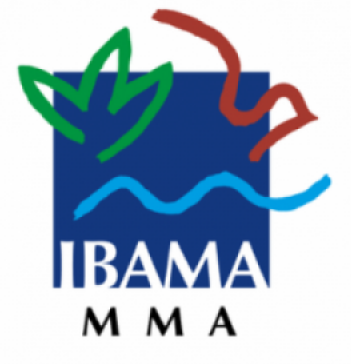

<!--StartFragment-->

 O questionário ficará disponível por [formulário eletrônico](https://docs.google.com/forms/d/1LhwS468i27IGqO2ABV-zyYNfaWlUnpYFwWPCUwRGejE/viewform?edit_requested=true), no período de 03/08 a 27/08. 

O Projeto de Modernização do RAPP tem como objetivo tornar o preenchimento e a entrega do Relatório mais simples para as pessoas físicas e jurídicas que devem a obrigação. Com isso, espera-se o aprimoramento da coleta de dados e a melhoria da experiência dos usuários. 

Para acessar os links e saber mais sobre o assunto leia a notícia na integra através do link: <https://www.omniaonline.com.br/ibama-lanca-pesquisa-de-opiniao-sobre-o-rapp/> 

<!--EndFragment-->