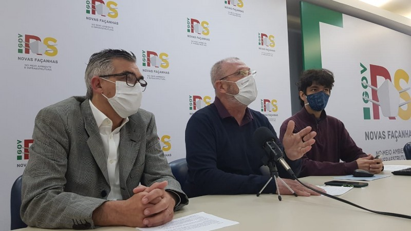

<!--StartFragment-->

O objetivo do encontro on-line foi divulgar o Índice de Salubridade Ambiental (ISA) do Rio Grande do Sul.

Na abertura, o secretário Luiz Henrique Viana ressaltou os benefícios que o Planesan trará para o Estado. “Este plano irá contribuir para o Rio Grande do Sul estabelecer diretrizes e estratégias para o saneamento básico em prol da melhoria na saúde pública e da qualidade de vida da população”.

O trabalho é coordenado pelo Departamento de Gestão de Recursos Hídricos e Saneamento (DRHS) da Sema. De acordo com o diretor do DRHS, Paulo Paim, “o Plano Estadual de Saneamento é um projeto pioneiro no Estado e está em fase de avaliação dos serviços de saneamento prestados em cada região, de análise da situação atual, deficiências e perspectivas futuras”.

Walter Souza, analista da Sema e coordenador do projeto, esclareceu que a ideia é que seja feito um plano interativo e que sirva como instrumento de política pública de fácil acesso para os gestores e para população do RS. “Queremos a participação de diversos atores do setor, para que possamos ter um relatório anual, com informações atualizadas dos municípios gaúchos”, destacou.

Acesse a notícia na íntegra em: <https://www.sema.rs.gov.br/plano-estadual-de-saneamento-apresenta-indice-de-salubridade-ambiental-do-rs>

<!--EndFragment-->